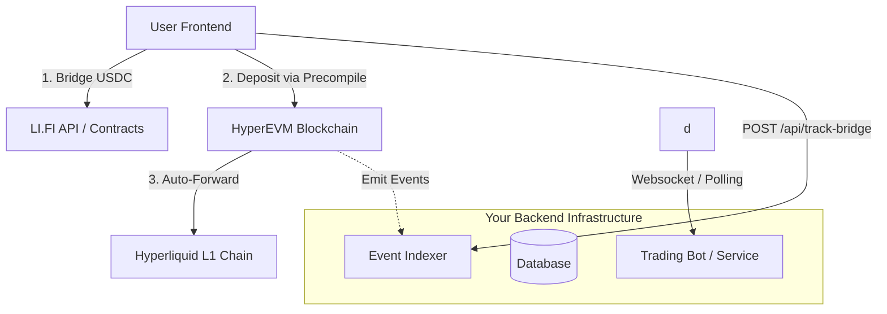

# HyperGate Backend Integration Guide

HyperGate is designed as a **client-side first** widget, leveraging decentralized protocols (LI.FI) and on-chain interactions (HyperEVM Precompiles). However, for production applications, you often need to link this with a backend infrastructure for analytics, user tracking, or triggering automated trading strategies.

## 1. Architecture Overview



## 2. Integration Strategies

### A. Tracking Deposits (The "Push" Method)
The easiest way to link to your backend is to have the frontend notify your server when a transaction is successful.

**Frontend (`HyperGate.tsx`):**
```typescript
const onRouteExecuted = async (route: any) => {
    // ... existing logic ...
    
    // Notify your backend
    await fetch('https://api.your-dapp.com/v1/bridge/success', {
        method: 'POST',
        headers: { 'Content-Type': 'application/json' },
        body: JSON.stringify({
            userAddress: userAddress,
            txHash: route.steps[0].execution.toTx,
            amount: route.toAmount,
            timestamp: Date.now()
        })
    });
};
```

**Backend (Node.js/Express Example):**
```javascript
app.post('/v1/bridge/success', async (req, res) => {
    const { userAddress, txHash, amount } = req.body;
    
    // 1. Verify the transaction on-chain (CRITICAL SECURITY STEP)
    // Don't trust the client blindly. Check the txHash on HyperEVM.
    const tx = await provider.getTransaction(txHash);
    if (tx.from !== userAddress) return res.status(401).send('Invalid Owner');
    
    // 2. Update User Balance in DB
    await db.users.update({ address: userAddress }, { $inc: { deposits: amount }});
    
    res.send('Recorded');
});
```

### B. Monitoring the Blockchain (The "Pull" Method)
For a more robust solution that doesn't rely on the client being online, run a backend worker that watches the **Asset Bridge Precompile** on HyperEVM.

**Contract Address**: `0x0000000000000000000000000000000000000804` (Verify in `constants.ts`)

**Backend Worker (Ethers.js/Viem):**
```typescript
import { createPublicClient, http, parseAbiItem } from 'viem';
import { hyperEvm } from 'viem/chains';

const client = createPublicClient({ chain: hyperEvm, transport: http() });

// Watch for Transfer events to the Bridge
client.watchEvent({
    address: '0x...USDC_CONTRACT...',
    event: parseAbiItem('event Transfer(address indexed from, address indexed to, uint256 value)'),
    args: { 
        to: '0x...ASSET_BRIDGE_PRECOMPILE...' 
    },
    onLogs: logs => {
        logs.forEach(log => {
            console.log(`Detected Deposit: ${log.args.value} USDC from ${log.args.from}`);
            // Trigger your business logic here
        });
    }
});
```

## 3. Triggering Hyperliquid Actions
If your goal is to **start trading** immediately after deposit:

1.  **Frontend**: User finishes bridging.
2.  **Backend**: Detects the deposit (via Method A or B).
3.  **Backend**: Uses the **Hyperliquid Python SDK** or API to execute trades.

```python
# Example Python Backend Logic
import hyperliquid.exchange as exchange
from hyperliquid.utils import types

def on_deposit_detected(user_address, amount):
    # Check if this user manages a sub-account or vault you control
    if user_address in MANAGED_ACCOUNTS:
        # Execute auto-buy strategy
        exchange.market_open(
            coin="ETH",
            is_buy=True,
            sz=amount / eth_price,
            px=eth_price,
            slippage=0.01
        )
```

## 4. API Security (Hiding Keys)
Currently, LI.FI requires an API Key. Exposing this in the frontend (`HyperGate.tsx`) is risky if you have high rate limits.

**Recommended Setup:**
1.  **Proxy Server**: Create an endpoint `GET /api/lifi/quote`.
2.  **Frontend**: Configures LiFiWidget to point to your proxy or fetch configuration from it.
3.  **Backend**: Forwards requests to `https://li.quest/v1/` attaching the `x-lifi-api-key` header server-side.

This ensures your API key is never visible to the user.
